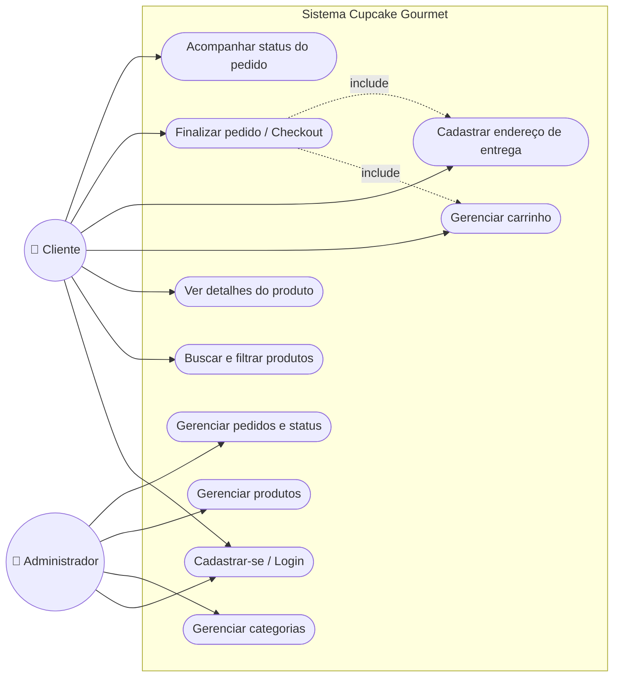

# Diagrama de Casos de Uso — Cupcake Gourmet

Dois atores interagem com o sistema: **Cliente** (usuário final que compra) e **Administrador** (gerencia o catálogo e os pedidos). Casos de uso pontilhados indicam relação `<<include>>` — o checkout depende de haver itens no carrinho e um endereço cadastrado.

## Descrição dos casos de uso principais

| Caso de uso | Ator | Descrição resumida |
|---|---|---|
| Cadastrar-se / Login | Cliente, Administrador | Criação de conta e autenticação via ASP.NET Core Identity |
| Buscar e filtrar produtos | Cliente | Pesquisa por nome e filtro por categoria no catálogo |
| Gerenciar carrinho | Cliente | Adicionar, atualizar quantidade e remover itens (mantido em sessão) |
| Cadastrar endereço de entrega | Cliente | Cadastro de um ou mais endereços vinculados ao cliente |
| Finalizar pedido / Checkout | Cliente | Escolhe endereço e forma de pagamento; gera Pedido, Itens e Pagamento |
| Acompanhar status do pedido | Cliente | Visualiza o histórico e o progresso (Recebido → Em preparo → Saiu para entrega → Entregue) |
| Gerenciar categorias / produtos | Administrador | CRUD de categorias e produtos do catálogo |
| Gerenciar pedidos e status | Administrador | Lista todos os pedidos e atualiza o status de entrega |
