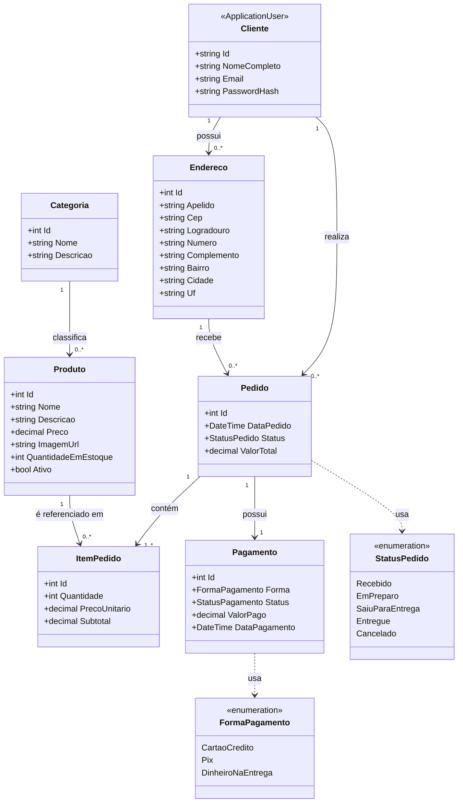

# Diagrama de Classes — Cupcake Gourmet

Reflete exatamente as entidades de `src/CupcakeGourmet.Web/Models`. Corresponde ao projeto lógico normalizado descrito no [dicionário de dados](../dicionario-de-dados.md).

## Notas de modelagem

- `Cliente` é implementado como `ApplicationUser` (ASP.NET Core Identity) — o papel Cliente/Administrador é controlado por roles do Identity, não por uma classe separada.
- `ItemPedido.PrecoUnitario` guarda o preço no momento da compra (histórico), evitando dependência transitiva do preço atual do `Produto` — mantém a 3ª Forma Normal.
- `Pedido` e `Pagamento` têm relacionamento 1:1 — cada pedido tem exatamente um registro de pagamento.
