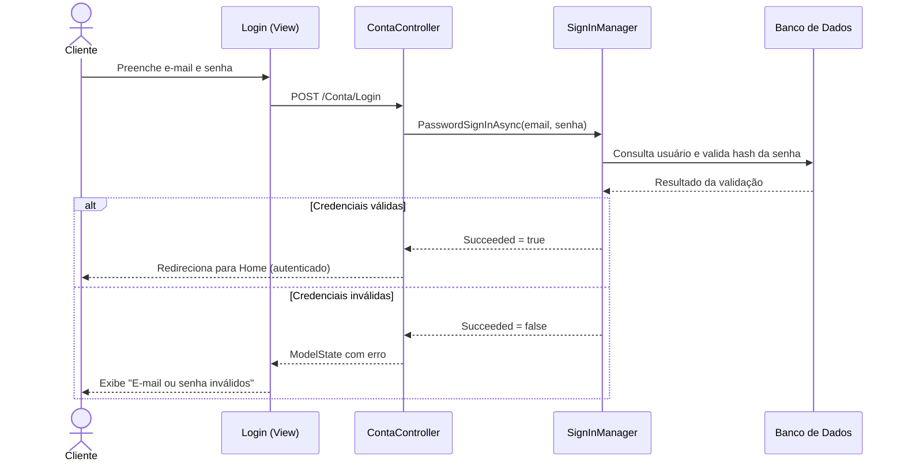

# Diagrama de Sequência — Login

Fluxo correspondente a `ContaController.Login` (`POST /Conta/Login`).

```mermaid
sequenceDiagram
    actor Cliente
    participant View as Login (View)
    participant Controller as ContaController
    participant SignInManager
    participant DB as Banco de Dados

    Cliente->>View: Preenche e-mail e senha
    View->>Controller: POST /Conta/Login
    Controller->>SignInManager: PasswordSignInAsync(email, senha)
    SignInManager->>DB: Consulta usuário e valida hash da senha
    DB-->>SignInManager: Resultado da validação
    alt Credenciais válidas
        SignInManager-->>Controller: Succeeded = true
        Controller-->>Cliente: Redireciona para Home (autenticado)
    else Credenciais inválidas
        SignInManager-->>Controller: Succeeded = false
        Controller-->>View: ModelState com erro
        View-->>Cliente: Exibe "E-mail ou senha inválidos"
    end
```
