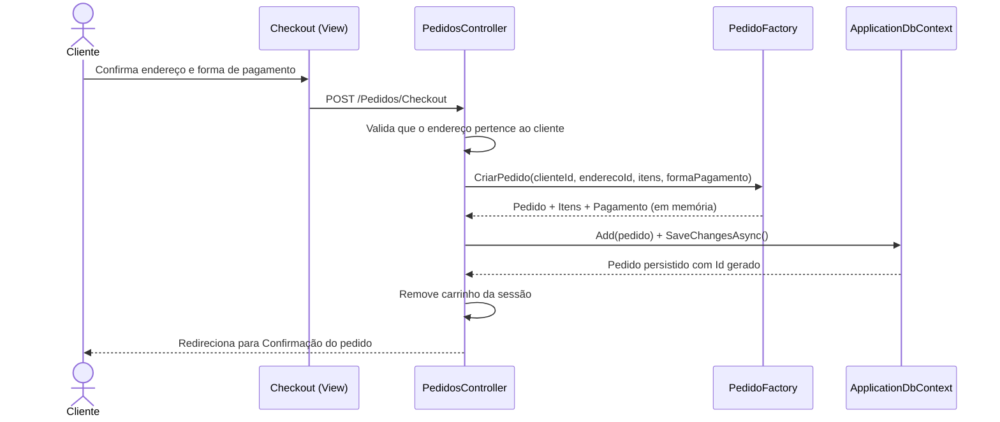

# Diagrama de Sequência — Realizar Pedido (Checkout)

Fluxo correspondente a `PedidosController.Checkout` (`POST /Pedidos/Checkout`), usando `PedidoFactory` para montar a entidade antes de persistir.

